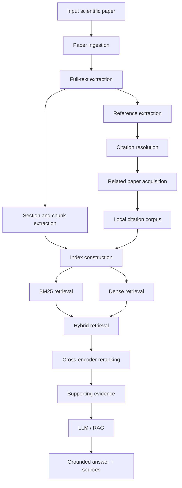

# Scientific Research Assistant

**Citation-Aware Retrieval and RAG for Scientific Papers**

A master's annual project focused on building a research assistant that works not only with a single scientific paper, but also with the local network of publications cited by that paper.

---

## Overview

Scientific papers rarely exist in isolation. Understanding a claim, method, or result often requires following references, opening cited papers, finding the relevant passages, and reconstructing the context manually.

Most existing "chat with PDF" systems operate only over the contents of a single document and do not explicitly use the citation structure on which scientific literature is built.

**Scientific Research Assistant** aims to solve this problem by building a searchable local knowledge space around a selected scientific paper.

The system will:

1. accept a scientific paper as an entry point;
2. extract its text and bibliography;
3. resolve cited references to real scientific publications;
4. retrieve available cited papers;
5. build a local citation-aware corpus;
6. index the original and related papers;
7. retrieve relevant evidence for a natural-language question;
8. generate a grounded answer with explicit supporting sources and text fragments.

The project is developed as an independent component with the possibility of later integration into the larger **ML Research Radar** system.

---

## Problem

When reading a scientific paper, understanding a particular statement frequently requires navigating its references.

A typical workflow looks like this:

```text
read paper
    ↓
find citation
    ↓
open cited paper
    ↓
search for relevant passage
    ↓
restore context
    ↓
return to original paper
```

This workflow becomes increasingly expensive when several cited works must be investigated.

Conventional document-level RAG systems reduce search effort inside one document, but do not directly model the local citation neighborhood of a scientific publication.

The project therefore focuses on **citation-aware retrieval** rather than only single-document question answering.

---

## Proposed Solution

The input is a scientific publication, initially represented by a PDF or an arXiv identifier / URL.

The system constructs a local knowledge space around the input paper:



Instead of searching only inside the original PDF, the system performs retrieval over the original publication and its related cited works.

---

## Retrieval Pipeline

A central part of the project is the comparison and combination of several Information Retrieval approaches.

### 1. Lexical retrieval

A BM25-based retriever will provide a simple and interpretable baseline.

```text
query
  ↓
BM25
  ↓
top-k passages
```

### 2. Dense retrieval

A bi-encoder will encode queries and document chunks into a shared embedding space.

```text
query
  ↓
bi-encoder
  ↓
vector search
  ↓
top-k passages
```

### 3. Hybrid retrieval

Lexical and dense retrieval results will be combined using an appropriate fusion strategy.

```text
BM25 ───────┐
            ├─→ fusion → candidates
bi-encoder ─┘
```

### 4. Cross-encoder reranking

The strongest candidates will be reranked using a cross-encoder:

```text
retrieval candidates
        ↓
cross-encoder
        ↓
reranked evidence
```

This pipeline makes it possible to evaluate the contribution of each retrieval component separately.

---

## Grounded RAG

The LLM layer is built **on top of retrieval**, not used as a replacement for it.

The expected answer structure is:

```text
Answer
+
Supporting passages
+
Paper identities
+
Source / section information
```

An answer without identifiable supporting evidence is not considered a successful system response.

Example:

```text
Question:
How does the proposed method differ from previous approaches?

Answer:
...

Evidence:
[1] Root paper — Methods, paragraph ...
[2] Smith et al. — Section 3, paragraph ...
[3] Doe et al. — Results, paragraph ...
```

---

## Evaluation

The project will evaluate retrieval separately from answer generation.

### Retrieval evaluation

Candidate metrics include:

- Recall@k
- MRR
- nDCG@k

The planned experimental comparison is:

| Retrieval configuration | Recall@k | MRR | nDCG@k | Latency |
|---|---:|---:|---:|---:|
| BM25 | — | — | — | — |
| Bi-encoder | — | — | — | — |
| Hybrid | — | — | — | — |
| Hybrid + cross-encoder | — | — | — | — |

### RAG evaluation

For a manually curated evaluation subset, the project will investigate:

- answer correctness;
- completeness;
- groundedness;
- citation correctness;
- whether the cited fragment actually supports the generated statement.

The exact evaluation protocol will be refined during development.

---

## Project Scope

The core scope of the project is:

```text
scientific paper
      ↓
full text
      ↓
references
      ↓
related papers
      ↓
local citation corpus
      ↓
BM25 + dense retrieval
      ↓
hybrid retrieval
      ↓
cross-encoder reranking
      ↓
evidence
      ↓
grounded RAG
```

### Initially out of scope

The project does **not** initially aim to implement:

- a large distributed scientific search engine;
- a full GraphRAG architecture;
- autonomous multi-agent research workflows;
- Kubernetes-based infrastructure;
- Kafka / Airflow pipelines;
- a multi-user SaaS platform;
- deep multi-hop citation graph expansion.

These components may be considered later only if they provide clear value to the core task.

---

## Architecture Principles

The repository is developed as a modular Python project.

Important principles:

- domain logic is separated from interfaces and infrastructure;
- retrieval is evaluated before RAG is added;
- ML components have explicit evaluation procedures;
- external providers should be accessed through defined interfaces;
- important intermediate artifacts should be reproducible;
- CLI, API, and UI layers should call shared application logic instead of duplicating it;
- service boundaries should be introduced only when they become useful.

The project intentionally starts as a modular monorepository rather than a collection of premature microservices.

---

## Technology Stack

### Project tooling

- Python 3.12
- uv
- Ruff
- mypy
- pytest
- pytest-cov
- pre-commit
- GitHub Actions

### Planned application stack

- Pydantic
- FastAPI
- Docker

### Planned retrieval stack

- BM25
- sentence-transformers / bi-encoder models
- cross-encoder reranking
- vector search backend

Specific libraries and infrastructure components will be selected when they become necessary and will not be added preemptively.

---

## Development Workflow

The project follows a reproducible development workflow:

```text
design
  ↓
implementation
  ↓
format / lint
  ↓
type checking
  ↓
tests
  ↓
evaluation
  ↓
review
```

Current local quality checks:

```bash
uv run ruff format --check .
uv run ruff check .
uv run mypy src tests
uv run pytest
```

The same core checks are executed automatically in CI.

---

## Project Roadmap

The work is organized into checkpoint-ready milestones so that each stage produces a demonstrable result.

### Checkpoint 1 — Project foundation

- finalize project topic and scope;
- create the repository;
- define the project architecture;
- prepare the annual roadmap;
- configure the Python development environment;
- configure linting, formatting, typing and tests;
- configure pre-commit hooks;
- configure continuous integration;
- document the project in README.

**Deliverable:** reproducible project foundation and documented technical plan.

### Stage 2 — Paper ingestion and text extraction

- support an initial paper input format;
- acquire PDF / source document;
- extract structured text;
- extract sections and paragraphs;
- define chunk representation;
- add tests for ingestion and parsing.

**Deliverable:** reproducible `paper → structured text → chunks` pipeline.

### Stage 3 — Retrieval baseline

- create a small evaluation corpus;
- define retrieval queries and relevance judgments;
- implement BM25;
- measure baseline retrieval quality;
- establish retrieval evaluation infrastructure.

**Deliverable:** measurable lexical-search baseline.

### Stage 4 — Dense and hybrid retrieval

- introduce a bi-encoder;
- create document embeddings;
- implement vector retrieval;
- compare dense retrieval with BM25;
- implement lexical + dense fusion.

**Deliverable:** experimentally evaluated hybrid retrieval system.

### Stage 5 — Reranking

- introduce a cross-encoder;
- rerank retrieval candidates;
- measure quality improvement;
- measure latency cost;
- perform retrieval ablations.

**Deliverable:** evaluated `BM25 + bi-encoder + cross-encoder` retrieval pipeline.

### Stage 6 — Citation extraction and resolution

- extract bibliography entries;
- identify DOI / arXiv / title / author metadata where possible;
- resolve references to scientific publications;
- acquire available cited papers;
- preserve provenance and resolution status.

**Deliverable:** root paper with resolved local citation neighborhood.

### Stage 7 — Citation-aware retrieval

- build indexes over the root paper and related publications;
- preserve paper identity for every retrieved fragment;
- distinguish evidence from the root paper and cited papers;
- evaluate retrieval over the local citation corpus.

**Deliverable:** citation-aware evidence retrieval.

### Stage 8 — Evidence-grounded RAG

- add the LLM layer;
- provide retrieved passages as evidence;
- generate answers with explicit citations;
- validate citation attribution;
- analyze unsupported or weakly supported answers.

**Deliverable:** grounded scientific question answering.

### Stage 9 — Application layer

- expose application functionality through an API;
- implement a minimal demonstration interface;
- provide access to answers and their supporting evidence;
- add reproducible application configuration.

**Deliverable:** end-to-end usable prototype.

### Stage 10 — Final evaluation and project completion

- run final retrieval experiments;
- evaluate RAG quality;
- analyze failure cases;
- measure latency and system trade-offs;
- finalize documentation;
- prepare reproducible deployment;
- prepare demonstration and presentation;
- describe future ML Research Radar integration.

**Deliverable:** evaluated, documented and reproducible final system.

The roadmap will be synchronized with the official university checkpoint schedule as the project progresses.

---

## Repository Structure

Current repository structure:

```text
scientific-research-assistant/
├── .github/
│   └── workflows/
│       └── ci.yml
├── src/
│   └── scientific_research_assistant/
│       └── __init__.py
├── tests/
│   └── test_package.py
├── .gitignore
├── .pre-commit-config.yaml
├── .python-version
├── pyproject.toml
├── README.md
└── uv.lock
```

Additional modules will be introduced when corresponding functionality is implemented.

---

## Relation to ML Research Radar

Scientific Research Assistant is developed as an **independent annual project**, not as a refactoring or fork of ML Research Radar.

ML Research Radar is a broader paper-centric ML/AI research platform containing ingestion, canonical paper identity, retrieval, scientific entity extraction, citation information, analytics and other derived layers.

The annual project focuses on one narrower component:

```text
full-text acquisition
        +
citation-aware local corpus
        +
passage retrieval
        +
reranking
        +
grounded RAG
```

After the annual project is completed and evaluated, its components may be integrated into ML Research Radar.

The integration boundary is intentionally not fixed in advance. Depending on the resulting architecture, the project may later be integrated as a Python module, package, service, or retrieval/RAG backend.

---

## Team

**Konstantin Nikiforov**  
Individual project

## Supervisor

**Timofey Sobornov**

---

## Academic Context

Master's annual project.

**Track:** Deep Learning  
**Level:** PRO

---

## Current Status

**Checkpoint 1 — Project foundation**

The repository and development environment are currently being initialized.